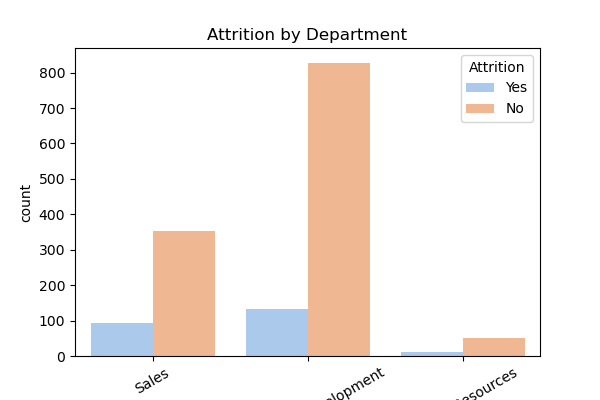
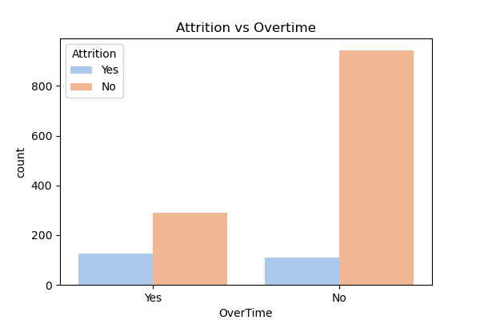

# HR Analytics – Employee Attrition

A data analysis project exploring employee attrition patterns using the IBM HR dataset.  
Tools: Python (pandas, numpy, matplotlib, seaborn).

---

## Business Problem
Employee attrition (turnover) is costly for organizations due to recruitment, training, and lost productivity.  

The goal of this analysis is to identify **key factors driving attrition** and recommend actionable strategies for HR to improve retention.

---

## Dataset
- Source: [IBM HR Analytics Dataset (Kaggle)](https://www.kaggle.com/datasets/pavansubhasht/ibm-hr-analytics-attrition-dataset)  
- Size: 1,470 employees  
- Features: Demographics, job role, income, job satisfaction, overtime, and attrition status (Yes/No).  

---

## Key Findings
- 16% attrition rate overall.  
- Employees who left were more likely to be:
  - Younger (20s–30s) and newer to the company (<3 years).  
  - Lower-paid, with monthly income below the company median.  
  - In Sales roles (especially Sales Representatives) or Human Resources.  
  - Working OverTime, which showed one of the strongest relationships to attrition.  

---

## Recommendations
- Improve compensation fairness (salary adjustments, performance-based bonuses).  
- Reduce overtime dependency by redistributing workload and hiring additional staff.  
- Strengthen early-career mentorship and development programs for younger employees.  
- Focus retention initiatives on Sales and HR departments.  

---

## Visuals
Here are a few example insights from the analysis:

  
Attrition is highest in Sales and lowest in R&D. 

  
Employees who work overtime are much more likely to leave.

---

## Tools Used
- Python: pandas, numpy, matplotlib, seaborn  
- Jupyter Notebook for analysis and storytelling  
